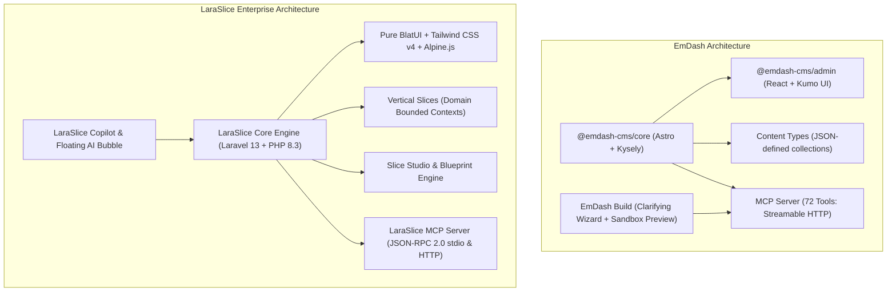
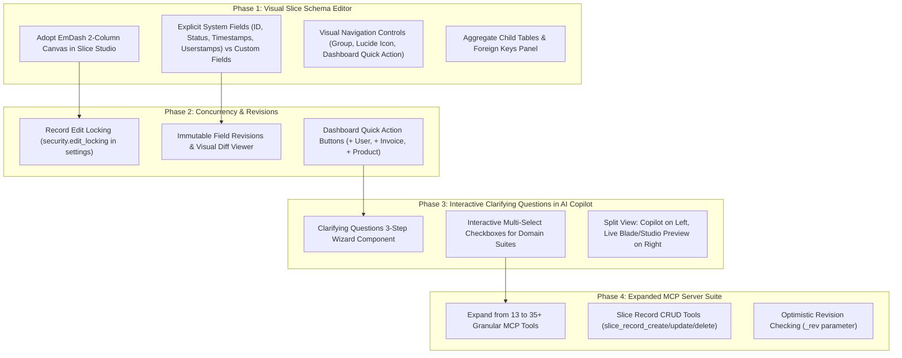

nm# Comprehensive Architectural Audit: EmDash CMS vs. LaraSlice
## Deep Analysis, UI/UX Deconstruction & Strategic Framework Improvement Plan

> **Executive Summary**  
> EmDash CMS is a modern TypeScript-based CMS built on Astro with a Cloudflare Kumo-inspired admin design, a sophisticated 2-column visual Content Type builder, granular edit locking, dynamic dashboard quick actions, a 72-tool MCP server over streamable HTTP, and an AI chat site builder (`emdash-build`) that utilizes structured interactive questionnaire steps (Clarifying Questions 1/3) alongside live split previews.
> 
> This document details every facet of EmDash's architecture, compares it to **LaraSlice Vertical Slice Architecture**, and presents a concrete, actionable roadmap to upgrade LaraSlice's Slice Studio, AI Copilot, Navigation Engine, and MCP capabilities.

---

## 1. High-Level Architectural Comparison



### Direct Paradigm Comparison Table

| Architectural Dimension | EmDash CMS | LaraSlice Enterprise | Strategic Advantage & Opportunity |
| :--- | :--- | :--- | :--- |
| **Foundation Stack** | Astro + TypeScript + React + Kysely | Laravel 13 + PHP 8.3 + Blade + Alpine.js | LaraSlice has enterprise database transactions, queue workers, and full-stack vertical slices. EmDash excels in frontend micro-interactions and headless Astro static speeds. |
| **Domain Modeling** | **Content Types** (collections with fields, relations, block types) | **Vertical Slices** (Domain aggregates with models, views, actions, contracts) | LaraSlice slices are complete business modules (not just content models). However, EmDash's visual content type editor has superior field categorization and settings layout. |
| **Visual Builder** | **Content Type Editor** (`/_emdash/admin/content-types`) | **Slice Studio & Blueprint Studio** (`/laraslice/wizard`) | EmDash's 2-column split (Settings on Left, Fields + Relations on Right) is significantly cleaner and less cluttered than single-column wizards. |
| **Sidebar & Nav** | Folder grouping by `group`, Phosphor icons, quick dashboard actions | Auto-discovery from `slice.yaml` and `laraslice_nav` | EmDash allows setting `Navigation Group`, `Icon`, `Hide from Nav`, and `Dashboard Quick Action` directly in the builder with instant UI preview. |
| **Concurrency & Safety** | **Edit Locking** (`is_locked`, `locked_by`) + **Revisions** (`_rev`) | Soft deletes, Audit Logs, and Userstamps | EmDash prevents concurrent overwrites when multiple admins edit records. LaraSlice can integrate this seamlessly into its User Security suite. |
| **MCP Integration** | **72 Granular Tools** (HTTP streamable transport) | **13 Lifecycle & Telemetry Tools** (stdio + HTTP) | EmDash has fine-grained CRUD and schema tools for every entity. LaraSlice can expand its MCP registry to cover slice data CRUD and visual navigation changes. |
| **AI Site Builder** | **EmDash Build** (`build.emdashcms.com`) | **LaraSlice AI Copilot & Natural Prompt Generator** | EmDash Build uses an **Interactive Clarifying Questions Wizard (1/3)** with multi-select checkboxes before code generation, plus a live split preview. LaraSlice should adopt this pattern immediately. |

---

## 2. Deconstruction of EmDash Admin UI & Flows

### A. Dashboard (`/_emdash/admin`)
- **Quick Action Bar (Top Right)**:
  - Header displays dynamic action buttons: `+ CRM`, `+ Page`, `+ Post`, `Upload Media`.
  - These buttons are not hardcoded—they are dynamically generated based on which content types have the switch `Quick action on the dashboard` enabled!
- **Metric Cards**:
  - Compact summary cards with count and badge: `Draft: 1`, `Media files: 7`, `User: 1`.
- **Content & Activity Split**:
  - Left Card: Content types breakdown showing total entries and published vs draft status pills (`🟢 7 published`, `🟡 1 draft`).
  - Right Card: Live audit activity feed with visual status icons, time-ago stamps, and 1-click edit links.

### B. Content Types Management (`/_emdash/admin/content-types`)
- **Listing View**:
  - Displays all registered types in a clean data table.
  - Columns:
    - **Name**: Icon avatar with background tint + Title.
    - **Slug**: Monospace pill (`crms`, `pages`, `posts`).
    - **Source**: Origin badge (`Dashboard`, `Plugin`, `Code`).
    - **Features**: Pill badges displaying active capabilities (`drafts`, `revisions`, `preview`, `search`, `seo`).
    - **Actions**: Edit (pencil), Delete (trash).
  - Header actions: `Relations` modal and `+ New Content Type`.
  - Bottom Section: **Block Types** definitions available for structured/portable text fields.

### C. Content Type Schema Editor (`/_emdash/admin/content-types/[slug]`)
The layout is a clean **2-Column Asymmetric Canvas**:

```
+------------------------------------------+-------------------------------------------------+
| LEFT COLUMN: SETTINGS (40%)              | RIGHT COLUMN: FIELDS & RELATIONS (60%)          |
+------------------------------------------+-------------------------------------------------+
| • Label (Singular): e.g. "CRM"           | FIELDS (6 system + 1 custom field) [+ Add Field]|
| • Label (Plural): e.g. "CRMs"            | ----------------------------------------------- |
| • Description: textarea                  | SYSTEM FIELDS (Read-only, standard across all)  |
|                                          | - ID (id) - ULID unique identifier              |
| ROUTING & CONCURRENCY                    | - Slug (slug) - URL identifier                  |
| [X] Routable (Requires slug)             | - Status (status) - draft, published, archived  |
| [X] Edit Locking (Prevents collisions)   | - Created At, Updated At, Published At          |
| URL Pattern: /crms/{slug}                |                                                 |
| Tokens: {slug}, {id}, {year}, {month}    | CUSTOM FIELDS (Sortable via drag-and-drop '::') |
|                                          | [::] Title (title) [String] [Required] [Edit]   |
| NAVIGATION CONTROLS                      | [::] Price (price) [Decimal] [Required] [Edit]  |
| • Navigation Group: "General" / "Sales"  |                                                 |
| • Icon: "briefcase" / "currency-dollar"  | RELATIONS (0 relations)      [+ New Relation]   |
| [ ] Hide from navigation                 | ----------------------------------------------- |
| [X] Quick action on dashboard            | Connects 1:1, 1:N, or N:M to other collections  |
|                                          | with cascade delete and foreign key mapping.    |
| FEATURES                                 |                                                 |
| [X] Drafts   [X] Revisions               |                                                 |
| [X] Preview  [X] Search                  |                                                 |
+------------------------------------------+-------------------------------------------------+
```

#### Key Strengths of this Editor:
1. **Explicit System Fields vs Custom Fields**:
   - Developers and users clearly see that `id`, `slug`, `status`, and timestamps are handled intrinsically by the engine. They cannot accidentally misconfigure or delete system columns.
2. **Built-in Concurrency & Edit Locking**:
   - `Edit locking` switch holds an entry while someone is actively editing, immediately warning secondary users to prevent lost work.
3. **URL Pattern Tokens**:
   - Allows permalink customization (`/{slug}`, `/blog/{year}/{month}/{slug}`, etc.) directly in the schema editor.
4. **Navigation Grouping**:
   - Grouping content types into collapsible sidebar accordion folders using a simple string label (`CRM`, `Commerce`, `System`).

---

## 3. EmDash Build (`emdash-build`) Chat Site Builder Analysis

The screenshot from `https://build.emdashcms.com/s/e484222c-63c9-42f3-9016-4f15055a5e4b` reveals a premier UX paradigm for AI-assisted framework generation:

```
+------------------------------------------+-------------------------------------------------+
| LEFT PANEL: INTERACTIVE AI CONVERSATION  | RIGHT PANEL: LIVE SPLIT PREVIEW                 |
+------------------------------------------+-------------------------------------------------+
| Project / build complete ERP             | [ Site ]  [ Admin ]      (Device viewport icons)|
|                                          |                                                 |
| User: "build complete ERP"               | +---------------------------------------------+ |
|                                          | |                                             | |
| AI Agent:                                | |            ...                              | |
| [?] Clarifying questions (1/3)       [X] | |        Preparing your site                  | |
| Answer to help me build what you want.   | |   The preview will appear automatically.    | |
|                                          | |                                             | |
| Which ERP areas should be included in    | +---------------------------------------------+ |
| the first complete build?                |                                                 |
|                                          |                                                 |
| [X] Dashboard and reporting              |                                                 |
| [X] Leads and clients (CRM)              |                                                 |
| [X] HR: employees, leave, shifts, etc.   |                                                 |
| [X] Work/projects and task tracking      |                                                 |
| [X] Finance and expenses/payroll basics  |                                                 |
|                                          |                                                 |
| [< Back]               [Skip]  [Next ->] |                                                 |
|                                          |                                                 |
| [ Input Box: Ask EmDash to change...   ] | [> Logs ] (Expandable build console output)     |
+------------------------------------------+-------------------------------------------------+
```

### Why this approach wins over conventional chat:
1. **Reduces Hallucination & Rework**:
   - Instead of immediately guessing the schema and generating 20 files, the AI presents a **structured questionnaire card** with pre-checked intelligent defaults.
2. **Zero-Friction User Interaction**:
   - The user doesn't have to type out a 500-word prompt. They simply toggle checkboxes and click **[Next ->]**.
3. **Live Visual Validation**:
   - The live preview tab on the right lets the user toggle between the generated public UI (`[Site]`) and the backend administration portal (`[Admin]`).
4. **Transparent Build Telemetry**:
   - The expandable `[> Logs]` console displays real-time execution steps (migration running, schema syncing, seeder execution) so technical users see exactly what the agent is executing.

---

## 4. EmDash 72-Tool MCP Server Deep Dive

In `packages/core/src/mcp/server.ts`, EmDash registers **72 native MCP tools** categorized into 9 domains:

```
EmDash MCP Registry (72 Tools)
├── Content Tools (16): content_list, content_get, content_create, content_update, content_delete,
│                       content_publish, content_unpublish, content_schedule, content_compare, ...
├── Schema Tools (13):  schema_list_collections, schema_get_collection, schema_create_collection,
│                       schema_update_collection, schema_delete_collection, schema_create_field,
│                       schema_update_field, schema_delete_field, schema_create_block_type, ...
├── Media Tools (7):    media_list, media_create, media_upload, media_get, media_update, media_delete, ...
├── Menu Tools (7):     menu_list, menu_get, menu_create, menu_update, menu_set_items, ...
├── Taxonomy Tools (10):taxonomy_list, taxonomy_create, taxonomy_create_term, taxonomy_update_term, ...
├── Byline Tools (6):   byline_list, byline_create, byline_update, byline_delete, ...
├── Revision Tools (2): revision_list, revision_restore
├── Transfer Tools (7): site_transfer_capabilities, site_export_start, site_import_analyze, ...
└── Search Tool (1):    search
```

### Key Architectural Strengths of EmDash's MCP Server:
- **`_rev` Optimistic Concurrency**:
  - Write tools accept a `_rev` parameter to prevent agents from overwriting stale data if another tool or user touched the record.
- **Structured Error Envelopes**:
  - Thrown exceptions return structured JSON error envelopes with machine-readable error codes (e.g. `TRANSFER_APPROVAL_REQUIRED`, `ENTRY_LOCKED`, `SLUG_IN_USE`) rather than raw text tracebacks.
- **Fenced vs Read-Only Tool Annotations**:
  - Tools declare `readOnlyHint: true` or `destructiveHint: true`. Destructive operations require explicit confirmation scopes.

---

## 5. Strategic Improvement Plan for LaraSlice

Based on the deep audit of EmDash, here is the concrete enhancement blueprint for LaraSlice:



### Actionable Enhancement Breakdown

### 1. Upgrade Slice Studio Schema Builder (`src/Wizard/views/wizard.blade.php`)
- **Implement 2-Column Asymmetric Canvas**:
  - **Left Panel (Settings)**:
    - Slice Title & Description.
    - Domain Grouping (`CRM`, `Commerce`, `HR`, `Security`).
    - Lucide Icon selector (e.g. `users`, `briefcase`, `shopping-bag`).
    - Toggles: `Routable (API & Web)`, `Edit Locking`, `Hide from Navigation`, `Quick Action on Dashboard`.
    - Features: `Drafts / Workflows`, `Soft Deletes`, `Userstamps Audit`, `Flutter Client Export`.
  - **Right Panel (Fields & Aggregates)**:
    - **System Fields Section**: Display intrinsic framework fields (`id`, `created_at`, `updated_at`, `created_by`, `updated_by`, `deleted_at`) in a locked, read-only table.
    - **Custom Slice Fields**: Drag-and-drop sortable list with type badges, validation chips (`Required`, `Unique`, `Nullable`), and edit drawer.
    - **Aggregate Child Tables (1:N Relations)**: Clear relational builder for line items, variants, or sub-entities.

### 2. Implement Dashboard Quick Action Bar (`resources/views/dashboard.blade.php`)
- Detect slices with `navigation.quick_action = true` in their `slice.yaml`.
- Render elevated action buttons at the top right of the dashboard:
  - `+ New User`, `+ New Order`, `+ New Ticket`, `+ New Contact`.
- Clicking opens a slide-over drawer or navigates directly to the creation form.

### 3. Add Edit Locking & Concurrency Protection
- Add `edit_lock_at` and `edit_lock_user_id` to slices with concurrency enabled.
- When an administrator opens a record, Alpine.js sends a heartbeat ping `/api/slices/{slice}/{id}/lock`.
- If another user accesses the same record, BlatUI displays a warning banner:
  > *⚠️ John Doe is currently editing this record (Locked 2m ago). You can view in read-only mode or request takeover.*

### 4. Interactive Clarifying Questions Component for LaraSlice Copilot
- When a user asks a complex generative prompt (e.g. *"Build complete ERP suite"* or *"Scaffold E-Commerce store"*):
  - Instead of generating code immediately, Copilot renders the **Clarifying Questions Widget**:
    - Step 1/3: Multi-select checkboxes for target modules.
    - Step 2/3: Business rules (workflow approval, currency, multi-tenant).
    - Step 3/3: Execution confirmation button `[Apply Blueprint & Generate]`.

### 5. Expand LaraSlice MCP Server Tools
- Add granular data and schema tools to [`McpServer.php`](file:///E:/Apps/message/LaraSlice/src/Core/Ai/McpServer.php):
  - `slice_record_list`: Filtered listing of records for any slice.
  - `slice_record_get`: Retrieve record with full aggregate relations.
  - `slice_record_create` / `slice_record_update` / `slice_record_delete`.
  - `slice_navigation_update`: Modify sidebar icon, group, and quick action from AI agent.
  - `slice_schema_diff`: View pending schema drift before applying migrations.

---

## 6. Implementation Roadmap

| Milestone | Deliverable | Target Component | Status |
| :--- | :--- | :--- | :--- |
| **M1** | **Audit & Comparative Blueprint** | `EMDASH_ANALYSIS_AND_IMPROVEMENT_PLAN.md` | Completed |
| **M2** | **Slice Studio 2-Column Canvas** | `src/Wizard/views/` (Settings Left, Fields Right) | Next Sprint |
| **M3** | **Clarifying Questions AI Widget** | `<x-ui.ai-copilot-bubble />` & Studio Copilot | Next Sprint |
| **M4** | **Dashboard Quick Actions Engine** | `resources/views/dashboard.blade.php` | Next Sprint |
| **M5** | **Expanded 35-Tool MCP Suite** | `src/Core/Ai/McpServer.php` | Planned |
